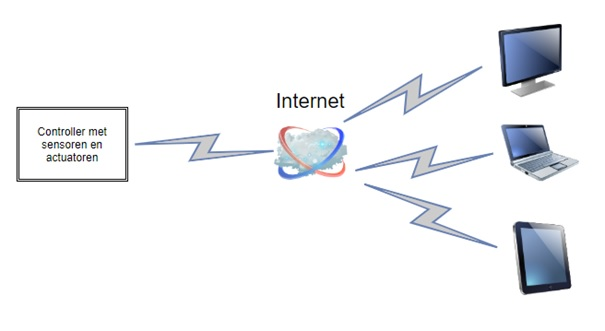
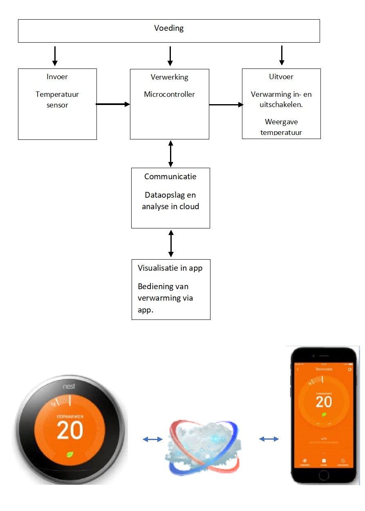
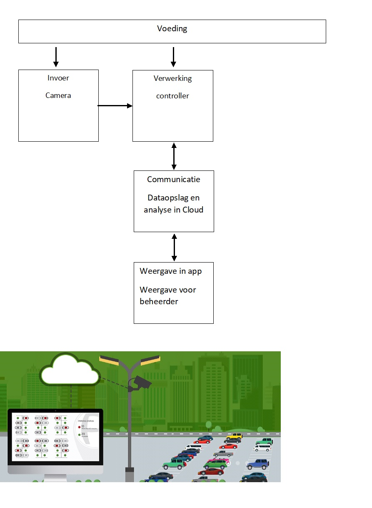

# Inleiding IOT

Het Internet of Things, in het Nederlands het Internet der Dingen, verwijst naar het geheel van apparaten die verbonden zijn met het internet. Hierdoor kunnen deze apparaten gegevens naar de cloud of een eigen database sturen, communiceren met elkaar, met computers, smartphones, …

Enkele voorbeelden zijn:

* Slimme thermostaten, waarbij de verwarming inschakelt volgens de gebruiksgewoontes van de bewoner.
* Detectie en weergave beschikbare parkeerplaatsen in een stadscentrum, parking ….
* Meten en registeren van energieverbruik en -productie. Verbruikers in- en uitschakelen, afhankelijk van de lokale energieproductie. 
* Bewatering in een serre aan de hand van detectie van de grondvochtigheid.
* Steps en slimme deelfietsen in steden.
* Detectie hoeveelheid vuilnis in een openbare vuilbak, glasbak ...
* Gebruikstijd, productie … van machines en toestellen registeren en analyseren.
* Domotica-systemen.
* …

# Voorbeelden

Slimme thermostaat 

*[Website Nest](https://store.google.com/be/product/nest_learning_thermostat_3rd_gen)

*[Voorstelling door Coolbue](https://www.youtube.com/watch?v=jfHO05LzPn8)

Detectie beschikbare parkeerplaatsen

*[Vlaamse producent IKANDA](https://ikanda.be/nl/oplossingen/parkingbeheer)

*[Uitleg industrial-iot.nl](https://industrial-iot.nl/slimme-parkeerplaatsen-in-de-slimme-stad/)

Energieverbruik en productie monitoren

*[Vlaamse producent Smappee](https://www.smappee.com/be_en/homepage)

*[Vlaamse producent 2-wire](https://www.2-wire.net/)

Slimme deelfietsen en steps

*[Website uber bike](https://www.uber.com/be/nl/ride/uber-bike/)

*[Voorstelling Jump by Uber](https://www.youtube.com/watch?v=lYBvx-kgr3A)

*[Circ deelsteps](https://goflash.com/)

*[Artikel rond deelsteps](https://gocar.be/nl/autonieuws/mobiliteit/elektrische-deelsteps-alles-wat-je-erover-moet-weten)

Slimme vuilbakken

*[Uitleg industrial-iot.n](https://industrial-iot.nl/prullenbakken-verbonden-met-internet/)

Gebruikstijd, productie … machines registeren en analyseren

*[Vlaamse leverancier](https://www.savaco.com/nl/events/detail/iot-in-de-praktijk-webinarreeks)

# Blokschema

Een mogelijk blokschema van een IOT-applicatie via cloud-communicatie kan er als volgt uitzien.

De controller op het toestel (Thing) kan informatie afkomstig van sensoren op het toestel doorsturen naar de cloud. De informatie wordt eventueel verwerkt en weergegeven op verschillende vormen van toestellen. 
Het is eveneens mogelijk vanop een computer, tablet, smartphone … actuatoren verbonden met de controller aan te sturen. Zoals bijvoorbeeld bij een domotica-systeem.  

# Opdrachten

Stel een mogelijk blokschema op van voorgaande slimme toestellen.

Voorbeeld slimme thermostaat

Voorbeeld detectie en weergave parkeerplaatsen

